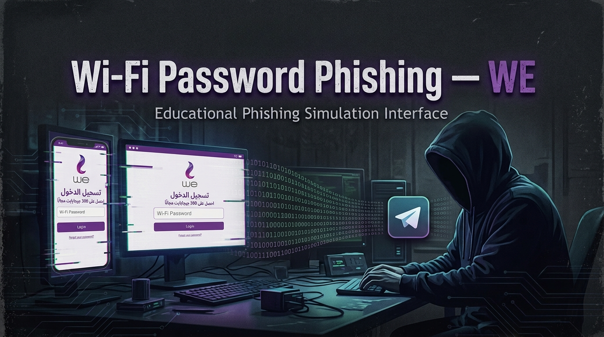

<p align="center">
  
</p>

# 🔐 Wi‑Fi Password Phishing — WE  
### *Educational Wireless Security Awareness Tool*

<p align="center">
  
  
  
  
  
</p>

---

> ⚠️ **هذا المشروع مُصمّم حصرياً للأغراض التعليمية واختبار الاختراق المصرح به وأبحاث الأمن السيبراني. أي استخدام غير قانوني ممنوع منعاً باتاً وقد يُعرّضك للمساءلة القانونية.**  
> **This project is designed exclusively for educational environments, authorized penetration testing and security research. Misuse is strictly prohibited and may be illegal.**

---
## 🧠 نظرة عامة | About
**Wi‑Fi Password Phishing — WE** هي أداة محاكاة مفتوحة المصدر وموجهة للاختبارات الأمنية، تهدف إلى توضيح كيفية استغلال المهاجمين لنقاط الوصول المزوّرة (Evil Twin) لخداع المستخدمين وسرقة كلمات مرور الشبكات اللاسلكية. تعيد الأداة إنشاء هجوم هندسة اجتماعية واقعي، ما يتيح للطلاب ومسؤولي الشبكات ومختصي الأمن السيبراني فهم هذا التهديد وتدريب أنفسهم على اكتشافه والدفاع ضده.

يشير الحرفان **“WE”** في الاسم إلى العلامة التجارية المستهدفة (شبكة We المصرية) وإلى **Wireless Exploitation**، تذكيراً بأن المعرفة قد تكون سلاحاً أو درعاً بحسب من يستخدمها.

يتضمن المستودع صفحة **بوابة احتجاز** (Captive Portal) جاهزة للاستخدام (انظر النموذج المرفق) تحاكي عرض “هدية 300 جيجابايت مجانية” من We، لخداع المستخدم وإدخال كلمة مرور الراوتر بالإضافة إلى بيانات شخصية أخرى.

---

## 🎓 الغرض التعليمي | Educational Purpose
صُمم هذا المشروع ليكون **مختبراً عملياً** في:

- دورات الأمن السيبراني الجامعية وبرامج التدريب على الاختراق الأخلاقي.
- برامج التوعية الأمنية في المؤسسات (بإذن كتابي صريح).
- توضيح سهولة تنفيذ هجوم “التوأم الشرير” باستخدام أجهزة شائعة.
- مساعدة المختصين في التعرف على مؤشرات هجمات التصيّد عبر الواي فاي.
- اختبار قابلية الموظفين أو الطلاب للوقوع في فخ الهندسة الاجتماعية في بيئة آمنة وقانونية.

**لا تستخدم هذه الأداة أبداً ضد أي شبكة أو جهاز دون الحصول على موافقة مسبقة وكتابية من المالك.**

---

## ✨ الميزات | Features

- **إنشاء نقطة وصول مزوّرة** – استنساخ أي شبكة واي فاي قريبة.
- **فصل العملاء تلقائياً** – إرسال حزم إنهاء الاتصال (Deauthentication) اختيارياً لإجبار العملاء الحقيقيين على إعادة الاتصال.
- **بوابة احتجاز قابلة للتخصيص** – تتضمن صفحة “هدية 300 جيجا” باللغة العربية (قالب We) ويمكن استبدالها بصفحتك الخاصة.
- **التقاط وتسجيل كلمات المرور** – حفظ البيانات المقدمة في قاعدة بيانات SQLite مشفرة محلياً؛ **لا تُرسَل** البيانات إلى أي طرف ثالث (ما عدا خاصية تسجيل الدخول إلى تيليجرام المضمنة في القالب، وهي اختيارية).
- **انتحال عنوان MAC** – محاكاة BSSID الأصلي لزيادة الواقعية.
- **تسجيل الجلسات** – تخزين جميع الخطوات لتسهيل مراجعة ما بعد التمرين.
- **الوضع الصامت (Headless)** – تشغيل كامل من سطر الأوامر، مناسب للمختبرات الآلية.
- **وضع التجربة الآمن (Dry‑run)** – محاكاة البنية التحتية دون إرسال أي حزم فصل.
- **إنهاء نظيف** – استعادة واجهات الشبكة اللاسلكية إلى حالتها الأصلية عند الضغط على `Ctrl+C`.

---

## ⚙️ آلية العمل | How It Works

1. **المسح** – تقوم الأداة بمسح الشبكات اللاسلكية القريبة وتتيح لك اختيار الهدف.
2. **الاستنساخ** – تنشئ نقطة وصول جديدة بنفس SSID، ومع إمكانية استخدام نفس BSSID عبر انتحال MAC.
3. **فصل العملاء** – إذا تم التفعيل، تُرسل الأداة حزم إنهاء اتصال للعملاء الشرعيين لإجبارهم على إعادة الاتصال.
4. **بوابة الاحتجاز** – عند اتصال أي عميل بالنقطة المزوّرة، تظهر له صفحة تسجيل دخول واقعية (انظر القالب المرفق) تطلب كلمة مرور الواي فاي بحجة مناسبة (مثل: “انتهت جلسة الاتصال – يرجى إعادة إدخال كلمة المرور للحصول على الهدية المجانية”).
5. **التقاط البيانات والتقرير** – تُخزَّن البيانات المدخلة محلياً، ويُولَّد تقرير شامل للمدرب.

تُسجَّل جميع الخطوات لتسهيل شرح تدفق الهجوم أثناء المحاضرات أو الدورات التدريبية.

---

## 🖥️ متطلبات التشغيل | Requirements

- نظام Linux (يوصى بـ Kali Linux أو Parrot OS).
- بطاقة شبكة لاسلكية تدعم وضع المراقبة (Monitor Mode) وإنشاء نقاط وصول.
- Python 3.6+.
- حزم Python المطلوبة (مذكورة في `requirements.txt`).

---

## 🚀 خطوات التثبيت والاستخدام | Installation & Usage

``` قم باتشغيل الملف باشكل محلي وتغير ال API الخاص باتوكن واضافة ID الخاص بك
